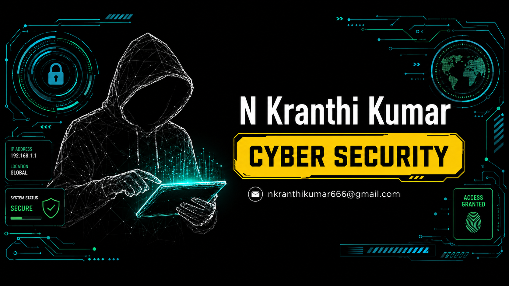
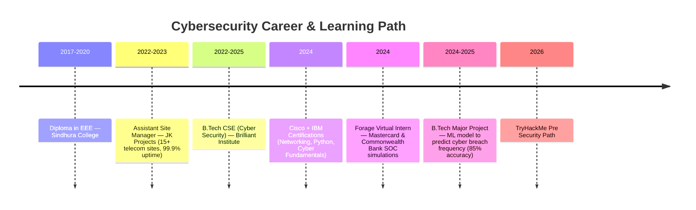

# 👋 Hi, I'm N Kranthi Kumar


🎯 **Cybersecurity & System Engineering professional** with hands-on experience in log analysis, threat detection, and system troubleshooting. Proficient in Linux/Windows administration, networking (TCP/IP, DNS, DHCP), and security tools like Splunk, Wireshark, Nmap, and Burp Suite. Seeking a **Cyber Security Analyst / SOC Analyst** role.

📍 Hyderabad, India &nbsp;•&nbsp; 📞 +91 9398085354 &nbsp;•&nbsp; ✉️ nkranthikumar666@gmail.com

---

## 🛡️ My Journey



---

## 🔗 Connect With Me

[](https://linkedin.com/in/kranthi-kumar-n-soc-vapt)
[](mailto:nkranthikumar666@gmail.com)
[](https://tryhackme.com)
[](https://github.com/YOUR_GITHUB_USERNAME)

---

## 🧰 Skills & Tools

### Core Competencies


### Security Tools
-000000?style=flat-square&logo=splunk&logoColor=white)


### Systems & Networking


### Programming & Data


---

## 📜 Certifications

| Certification | Issuer | Date |
|---------------|--------|------|
| 🥇 Pre Security Path | TryHackMe | Jun 2026 |
| 🐍 Python Essentials 1 | Cisco | Nov 2024 |
| 🌐 Networking Basics | Cisco | Sep 2024 |
| 🔐 Cybersecurity Fundamentals | IBM | Sep 2024 |
| 🛡️ Introduction to Cybersecurity | Cisco | Aug 2024 |

---

## 💼 Experience

### 🛰️ Cybersecurity Analyst (Virtual Intern)
**Mastercard & Commonwealth Bank — Forage Job Simulations** &nbsp; • &nbsp; Oct 2024

- Monitored security events using **Splunk (SIEM)**, identifying and mitigating 20+ potential threats.
- Conducted packet analysis with **Wireshark**, detecting anomalies in network traffic.
- Performed vulnerability assessments using **Nmap** and **Burp Suite**, reporting 10+ critical weaknesses.
- Completed phishing analysis simulations and developed security awareness training materials, improving team compliance by 40%.
- Authored technical incident response reports with risk mitigation strategies.

### 🏗️ Assistant Site Manager
**JK Projects** &nbsp; • &nbsp; Feb 2022 – Apr 2023

- Managed system operations & maintenance across **15+ telecom sites**, ensuring **99.9% uptime**.
- Resolved **50+ technical anomalies monthly**, reducing downtime by **30%** through proactive troubleshooting.
- Enforced security and safety compliance, mitigating operational risks.
- Authored detailed technical reports and tracked KPIs using data-driven metrics.
- Led cross-functional teams to resolve critical issues under tight deadlines.

---

## 🚀 Projects

### 📊 Modelling and Predicting Cyber Hacking Breaches
`B.Tech Major Project` • `2024–2025` • `Python` `Machine Learning` `SQL` `Data Visualization` `ARMA-GARCH` `Stochastic Modeling`

Built a machine learning model to predict cyberattack frequency and breach severity with **85% accuracy**. Analyzed threat data using stochastic modeling and visualization, producing a realistic cyber-risk assessment framework supporting threat forecasting and security planning.

### 🐛 Social Media Misinformation Detection
`Mini Project` • `2023` • `Python` `Machine Learning` `UML` `Game Theory` `System Testing`

Designed a system to detect and reduce the spread of misinformation, applying ML and game theory for fake-news analysis. Created UML diagrams and validated functionality through rigorous system testing, reducing misinformation spread by **30%**.

---

## 🎓 Education

| Degree | Institution | Duration |
|--------|-------------|----------|
| **B.Tech in CSE (Cyber Security)** | Brilliant Institute of Engineering and Technology | Dec 2022 – Jul 2025 |
| **Diploma in Electrical & Electronics Engineering** | Sindhura College of Engineering & Technology | Jun 2017 – Aug 2020 |

---

## 📈 GitHub Stats

<p align="center">
  
  
</p>

<p align="center">
  
</p>

---

## 📫 Get in Touch

<p align="center">
  <a href="mailto:nkranthikumar666@gmail.com"></a><br><br>
  <a href="https://linkedin.com/in/kranthi-kumar-n-soc-vapt"></a><br><br>
  <a href="tel:+919398085354"></a>
</p>

---

<p align="center">
  <i>"Think like an attacker, defend like a pro."</i><br><br>
  
</p>
```
